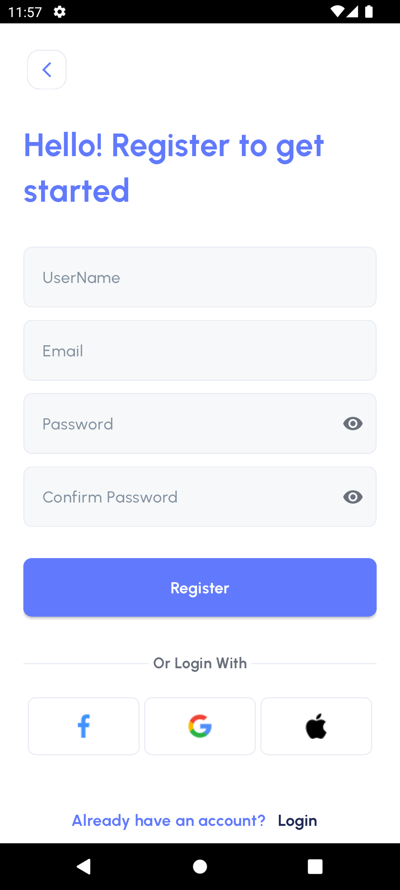
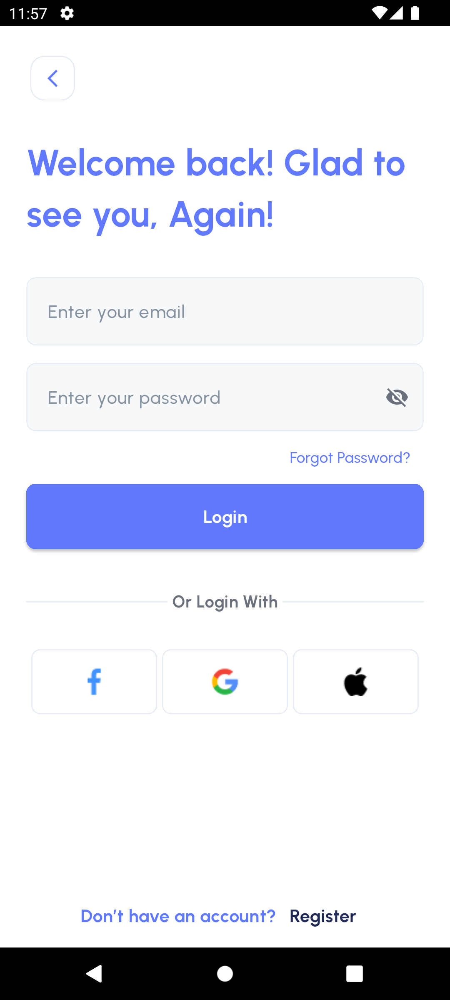
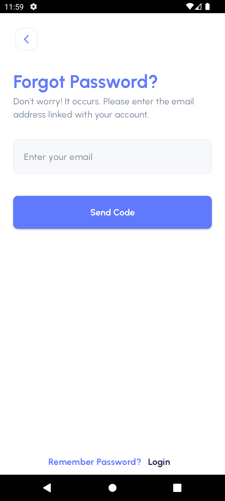
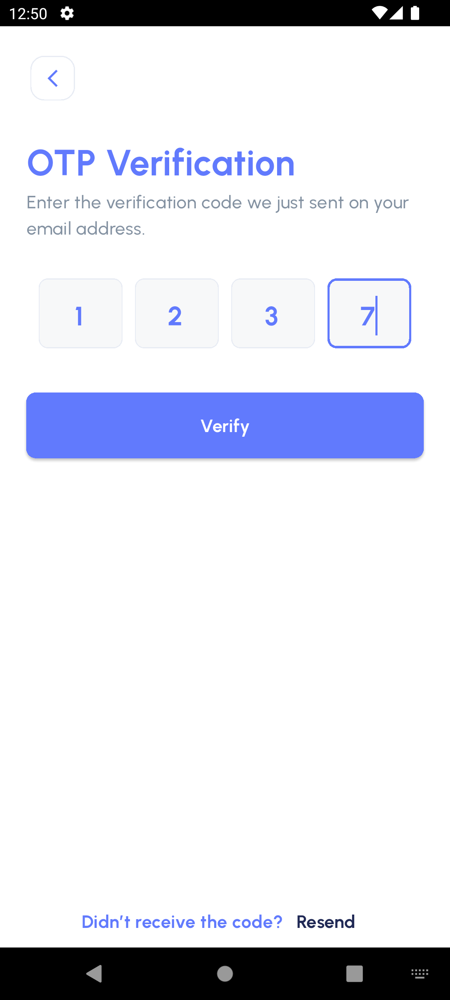
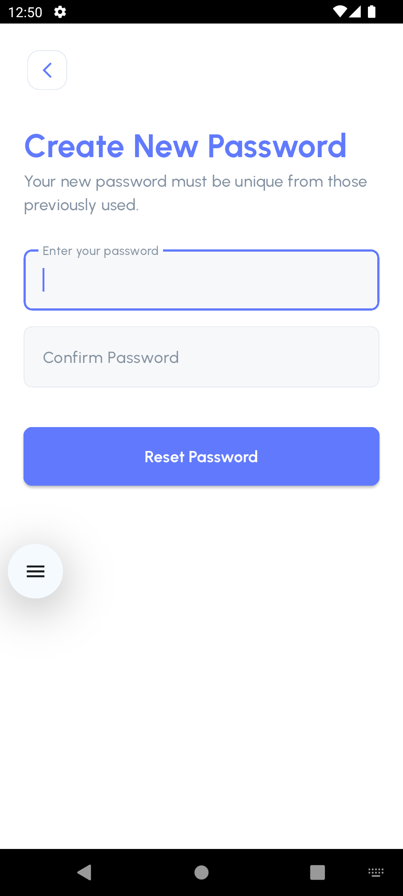
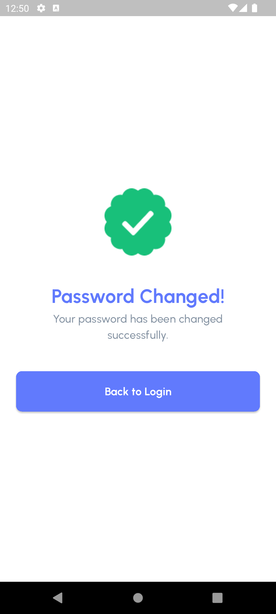
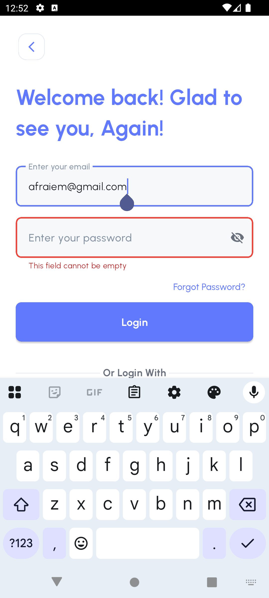
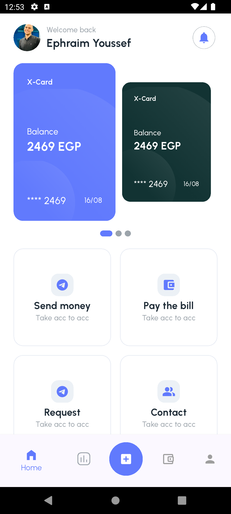
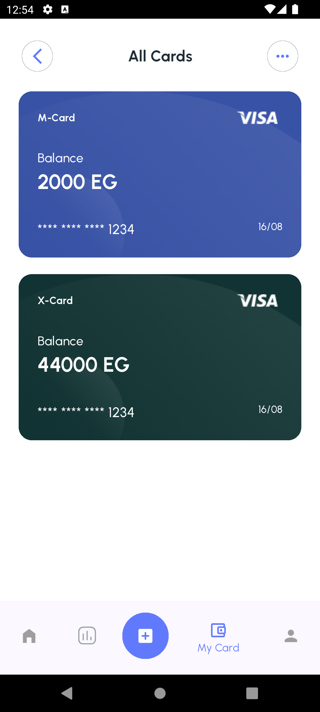
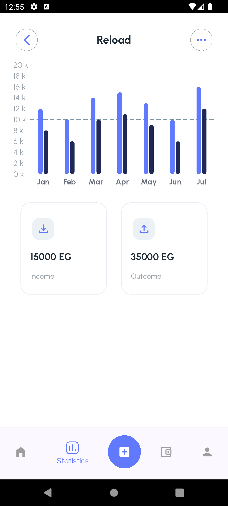

# 💰 Finance App

A modern, user-friendly finance management application built with clean architecture and powerful data visualization.

## 🚀 Features

- ✅ **User-Friendly Interface**  
  Designed with an intuitive UI/UX to help users manage their finances effortlessly across all devices.

- 📱 **Responsive Design**  
  Fully responsive layout that adapts to mobile, tablet, and desktop screens.

- 🏗️ **Clean Architecture**  
  Follows a layered architecture pattern (Data, Domain, Presentation) for maintainability, testability, and scalability.

- 📊 **Bar Chart Visualization**  
  Integrated interactive bar charts to display:
  - Expense trends
  - Income analysis
  - Monthly financial summary

- 🔐 **Secure & Reliable**  
  Built with best practices in mind to ensure performance and data security.

## 🧱 Tech Stack

- **Flutter** – UI development
- **Dart** – Application logic
- **Provider/Bloc/Cubit** – State management *(Choose your actual state management)*
- **Charts Package** – For bar chart visualization
- **Firebase / Local DB** – (If applicable) for authentication or storage
- **Clean Architecture** – Domain-driven design with layered separation

## 📸 Screenshots
| | | | | 
|--|--|--|--|
|  |  |  |  |
| |  |  |  |
| |  | |  |


## 📦 Folder Structure (Clean Architecture)
```bach
lib/
├── core/
├── data/
│ └── datasources/
│ └── models/
│ └── repositories/
├── domain/
│ └── entities/
│ └── repositories/
│ └── usecases/
├── presentation/
│ └── blocs/ or cubits/
│ └── pages/
│ └── widgets/
```

## 🛠️ Getting Started

### Prerequisites

- Flutter SDK installed
- Dart SDK installed
- Git installed

### Steps

1. Clone the repository:
   ```bash
   git clone https://github.com/yourusername/finance_app.git
   cd finance_app
